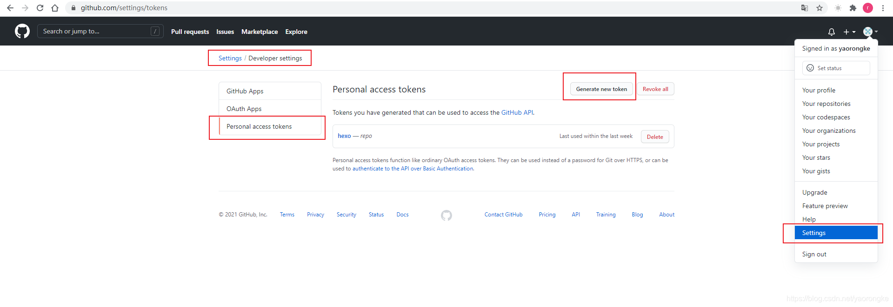

# blog
Hexo搭建

## 安装Hexo

```shell
npm install hexo-cli -g # 全局安装hexo的命令行程序 
hexo init blog # 初始化项目 
cd blog # 切换到项目目录 
yarn install # 安装项目依赖 
yarn server # 启动hexo服务
```
然后在浏览器中访问 http://localhost:4000 就可以看到博客页面了。

## 更换主题(fluid主题)

下载fluid主题：
```shell
cd blog
git clone https://github.com/fluid-dev/hexo-theme-fluid.git themes/fluid
```
修改配置文件`_config.yml`中的相关字段：
```yaml
# 指定主题
theme: fluid  
# 指定语言，会影响主题显示的语言，按需修改
language: zh-CN  
# 在生成文章的时候生成一个同名的资源目录用于存放图片文件
post_asset_folder: true
```

## 创建「关于页」

首次使用主题的「关于页」需要手动创建：
```shell
yarn new page about
```
创建成功后，编辑博客目录下 /source/about/index.md，添加 layout 属性。
```text
---
title: about
date: 2025-05-03 02:27:47
layout: about
---
```

## 创建文章

```shell
yarn new 文章标题
```

## 部署到GitHub Pages

````shell
yarn add hexo-deployer-git --save # 安装hexo-deployer-git插件
````
修改根目录下的 _config.yml，配置 GitHub 相关信息
```yaml
deploy:
  type: git
  repo: git@github.com:hanke-janson/blog.git
  branch: main
  token: # 请替换成自己的 GitHub Personal Access Token
```
其中 token 为 GitHub 的 Personal access tokens，获取方式如下图所示：



```shell
yarn build # 编译博客
yarn deploy # 部署博客到GitHub Pages
```

